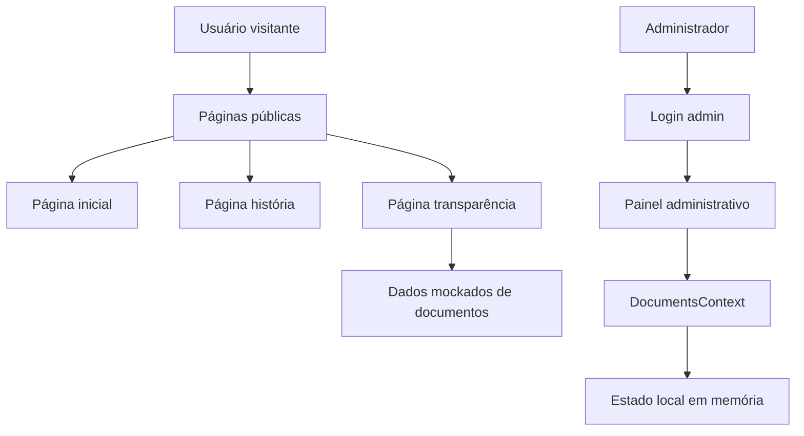
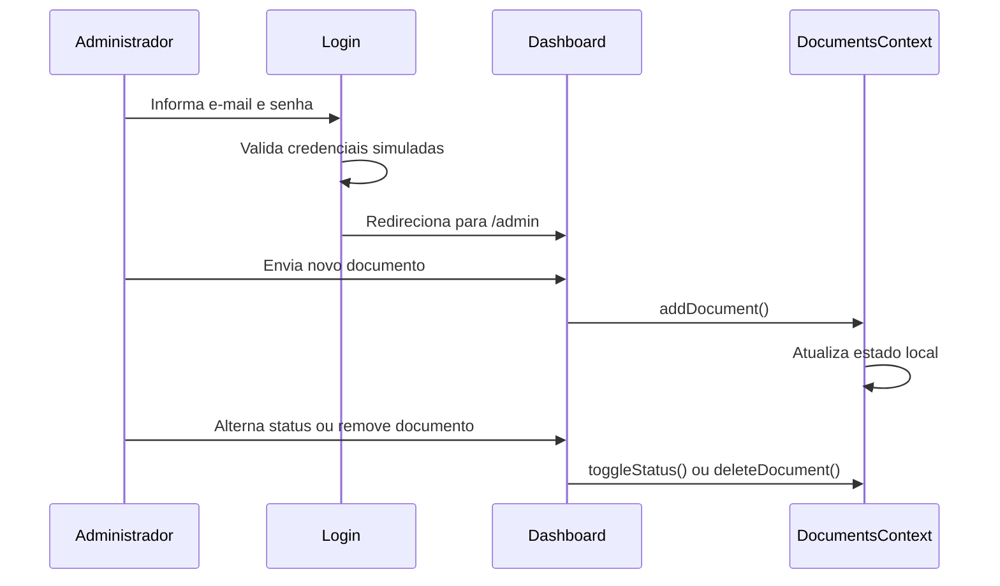

# Site Zambo

Site institucional do Ponto de Cultura Zambo, desenvolvido em Next.js para apresentar a história do projeto, indicadores, membros, apoiadores e uma área de transparência com documentos públicos.

## Sumário

- [Funcionalidades](#funcionalidades)
- [Tecnologias](#tecnologias)
- [Manual de instalação](#manual-de-instalação)
- [Scripts disponíveis](#scripts-disponíveis)
- [Estrutura do projeto](#estrutura-do-projeto)
- [Esquemas](#esquemas)
- [Códigos principais](#códigos-principais)
- [Deploy](#deploy)
- [Licença](#licença)

## Funcionalidades

- Página inicial com hero, estatísticas, história, membros, apoiadores e rodapé.
- Página de história em `/historia`.
- Página de transparência em `/transparencia`, com documentos organizados por ano e categoria.
- Painel administrativo em `/admin`, com login simulado e gestão local de documentos.
- Interface responsiva para desktop e dispositivos móveis.

## Tecnologias

- Next.js 16
- React 19
- TypeScript
- Tailwind CSS 4
- OpenNext para Cloudflare
- Wrangler para preview, upload e deploy em Cloudflare Workers

## Manual de instalação

### Pré-requisitos

Instale antes de executar o projeto:

- Node.js 20 ou superior
- npm
- Git

Para deploy na Cloudflare, também é necessário ter uma conta Cloudflare e autenticar o Wrangler.

### Passo a passo

Clone o repositório e entre na pasta do site:

```bash
git clone <url-do-repositorio>
cd zambo/site
```

Instale as dependências:

```bash
npm install
```

Execute o ambiente de desenvolvimento:

```bash
npm run dev
```

Acesse no navegador:

```text
http://localhost:3000
```

Para gerar a versão de produção:

```bash
npm run build
```

Para testar a aplicação no runtime local da Cloudflare:

```bash
npm run preview
```

## Scripts disponíveis

| Script | Comando executado | Finalidade |
| --- | --- | --- |
| `npm run dev` | `next dev --port 3000` | Inicia o servidor local de desenvolvimento. |
| `npm run build` | `next build` | Gera a build de produção do Next.js. |
| `npm run start` | `next start` | Inicia a build de produção localmente. |
| `npm run lint` | `next lint` | Executa a verificação de lint configurada para Next.js. |
| `npm run preview` | `opennextjs-cloudflare build && opennextjs-cloudflare preview` | Compila e executa a aplicação no ambiente local da Cloudflare. |
| `npm run upload` | `opennextjs-cloudflare build && opennextjs-cloudflare upload` | Compila e envia a aplicação para a Cloudflare. |
| `npm run deploy` | `opennextjs-cloudflare build && opennextjs-cloudflare deploy` | Compila e publica a aplicação na Cloudflare. |
| `npm run cf-typegen` | `wrangler types --env-interface CloudflareEnv ./cloudflare-env.d.ts` | Gera tipos TypeScript para o ambiente Cloudflare. |

## Estrutura do projeto

```text
site/
├── public/
│   ├── favicon.svg
│   └── zambo/                  # Imagens exportadas para a interface
├── src/
│   ├── app/
│   │   ├── page.tsx            # Página inicial
│   │   ├── historia/           # Página de história
│   │   ├── transparencia/      # Página de documentos públicos
│   │   └── admin/              # Login e painel administrativo
│   ├── components/             # Componentes reutilizáveis da interface
│   └── imports/                # Arquivos gerados/importados do layout
├── next.config.ts
├── open-next.config.ts
├── wrangler.jsonc
├── package.json
└── README.md
```

## Esquemas

### Arquitetura da aplicação



No estado atual, os documentos são dados mockados no front-end. O painel administrativo usa `sessionStorage` para simular autenticação e `useState` para simular criação, remoção e publicação de documentos.

### Esquema de documento administrativo

Definido em `src/app/admin/DocumentsContext.tsx`:

```ts
type DocCategory =
  | "Prestação de Contas"
  | "Relatório de Atividades"
  | "Plano de Trabalho"
  | "Ata de Reunião"
  | "Edital";

interface AdminDocument {
  id: string;
  title: string;
  category: DocCategory;
  description: string;
  year: number;
  fileType: "PDF" | "XLSX" | "DOC";
  fileSize: string;
  fileName: string;
  publishedAt: string;
  status: "published" | "draft";
}
```

### Esquema de documento público

Definido em `src/app/transparencia/Transparencia.tsx`:

```ts
interface Document {
  id: string;
  title: string;
  category: DocCategory;
  description: string;
  fileType: "PDF" | "XLSX" | "DOC";
  fileSize: string;
  date: string;
}

interface YearGroup {
  year: number;
  documents: Document[];
}
```

### Fluxo de administração de documentos



## Códigos principais

- `src/app/page.tsx`: compõe a página inicial com os blocos principais do site.
- `src/components/ZamboHero.tsx`: seção inicial da página pública.
- `src/components/ZamboStats.tsx`: indicadores exibidos no site.
- `src/components/ZamboHistoria.tsx`: resumo da história e chamada para a página de história.
- `src/components/ZamboMembros.tsx`: apresentação dos membros.
- `src/components/ZamboApoiadores.tsx`: lista de apoiadores.
- `src/components/ZamboFooter.tsx`: rodapé institucional.
- `src/app/transparencia/Transparencia.tsx`: página pública de transparência e listagem de documentos.
- `src/app/admin/Login.tsx`: tela de login administrativo.
- `src/app/admin/AdminAuthContext.tsx`: autenticação simulada do painel.
- `src/app/admin/DocumentsContext.tsx`: estado e operações simuladas dos documentos.
- `src/app/admin/Dashboard.tsx`: interface de gestão dos documentos.

## Deploy

O deploy está configurado para Cloudflare Workers com OpenNext. As principais configurações ficam em:

- `wrangler.jsonc`: nome do worker, compatibilidade, assets e bindings.
- `open-next.config.ts`: configuração do OpenNext para Cloudflare.
- `cloudflare-env.d.ts`: tipos do ambiente Cloudflare.

Antes do deploy, autentique o Wrangler:

```bash
npx wrangler login
```

Depois execute:

```bash
npm run deploy
```

## Observações técnicas

- O projeto ainda não possui API ou banco de dados persistente.
- O login administrativo é simulado com credenciais mockadas.
- O upload de documentos no painel atualiza apenas o estado em memória durante a sessão.
- Os comentários `TODO` no código indicam os pontos previstos para integração futura com API real.

## Licença

Este projeto está licenciado sob a GNU General Public License v3.0 ou posterior.

Veja o arquivo `LICENSE` para mais detalhes. O identificador SPDX usado no projeto é:

```text
GPL-3.0-or-later
```
